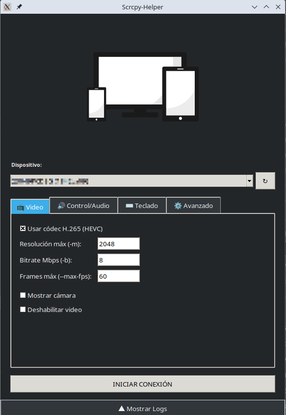

# 📱 Scrcpy-Helper (v1.2.1)

Una interfaz gráfica sencilla y ligera construida en Python con Tkinter para gestionar conexiones de [scrcpy](https://github.com/Genymobile/scrcpy?tab=readme-ov-file) con detección dinámica de dispositivos.

(Compatible con scrcpy(v3.3.4))

## 🚀 Características

- Detección Automática: Detecta tus móviles vía ADB al instante.
- Sin Dependencias de Entorno: Funciona en KDE, GNOME, XFCE o cualquier gestor de ventanas sin instalar librerías extra de GTK/Qt.
- Portable: Disponible como binario único gracias a Nuitka.
- Privacidad: Ejecución 100% local y transparente.
- Se guardan las opciones elegidas previamente en `~/.config/scrcpy-helper`.
- Botón de recarga para ver nuevos dispositivos conectados.
- Conexión rápida con tecla "Barra espaciadora"

## 🛠 Requisitos Previos

**En Arch Linux**

    sudo pacman -S android-tools scrcpy

**En Ubuntu/Debian**

    sudo apt install adb scrcpy

**Nota**: Recuerda tener activada la Depuración USB en las opciones de desarrollador de tu dispositivo Android.

## 📥 Instalación y Uso

- Ve a la sección de Releases y descarga el archivo scrcpy-tool.
- Dale permisos de ejecución al archivo:
  
**Bash**

    chmod +x scrcpy-tool

    ./scrcpy-tool

**Interfaz Gráfico**
- Click derecho, propiedades, marcar "es ejecutable"
- Doble click a `scrcpy-helper`

## 🛡 Verificación de Integridad

Para garantizar que el archivo no ha sido alterado, puedes verificar su hash SHA-256:

- Descarga el binario y el archivo checksums.txt en la misma carpeta.
- Ejecuta:
    - sha256sum -c checksums.txt
    - Si todo es correcto, verás: `scrcpy-tool: La correspondencia es exacta`.

## Compilación manual

Descarga los archivos fuente y ejecuta:

    python3 -m nuitka \
    --standalone \
    --onefile \
    --enable-plugin=tk-inter \
    --linux-icon=ico.png \
    --remove-output \
    -o scrcpy-helper \
    scrcpy_helper.py

## Tabs con opciones

**Video**

- `--video-codec=h265` "Usar códec h265"
- `-m {max-res}` "limitar la resolución a max-res (por ejemplo 1024)"
- `-b {Mbps}` "limitar el bit rate a Mbps (default 8M)"
- `--max-fps={fps}` "limitar los frames a fps"
- `--video-source=camera` "Mostrar la cámara"
- `--no-video` "Deshabilitar el video"

**Control / Audio**

- `-S` "Apagar pantalla del dispositivo"
- `-w` "Mantener encendido"
- `-power-off-on-close` "Apagar al cerrar la aplicación"
- `-t` "Mostrar toques"
- `-n` "Deshabilitar el control"
- `--no-audio` "Deshabilitar el audio"
- `--audio-source=mic` "Capturar el micrófono"

**Teclado**

- `--prefer-text` "Preferir eventos de texto"
- `--raw-key-events` "Forzar raw key events"
- `--no-key-repeat` "Evitar repetición de teclas"

**Avanzado**

Cuadro de texto para comandos personalizados. Para más información, vea la [documentación](https://github.com/Genymobile/scrcpy/tree/master/doc).

## Referencias

Icono tomado de [madartzgraphics](https://pixabay.com/es/illustrations/artilugio-dispositivos-tecnolog%c3%ada-1917227/)

